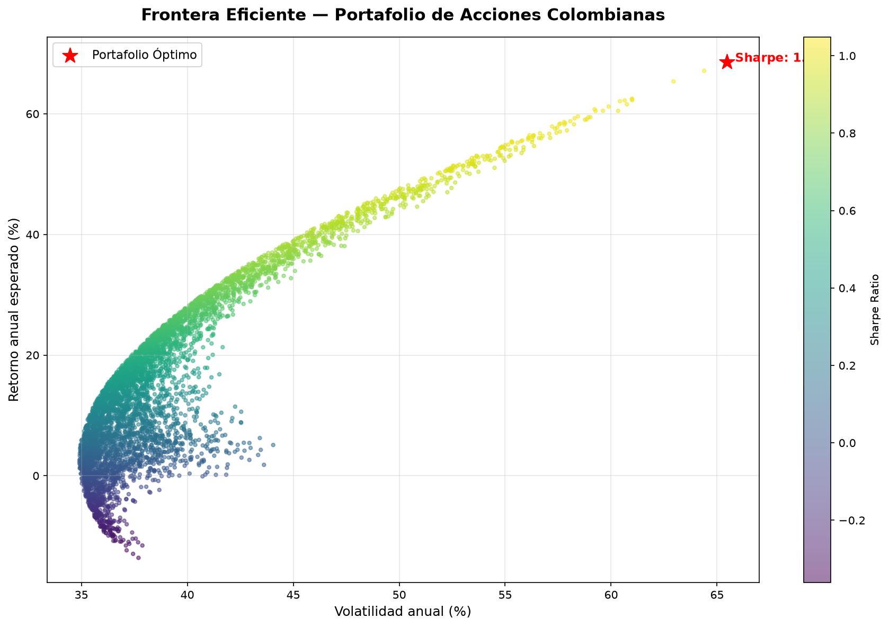
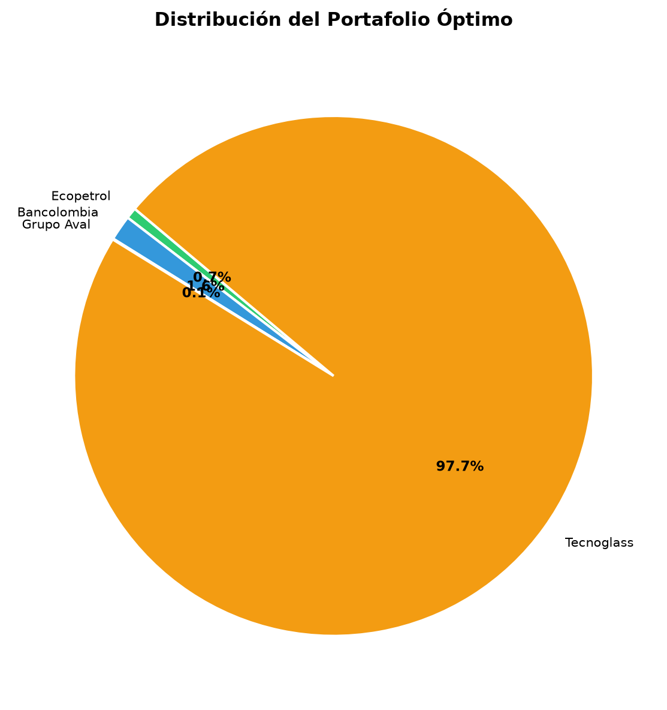

# Optimización de Portafolio — Bolsa de Valores de Colombia


## Descripción
Aplicación de la **Teoría Moderna de Portafolios de Markowitz** para optimizar una cartera de acciones colombianas listadas en NYSE, maximizando el **Sharpe Ratio** mediante simulación Monte Carlo de 5.000 portafolios.

## Objetivos
- Identificar la **frontera eficiente** del portafolio
- Determinar la **asignación óptima** de activos
- Maximizar retorno ajustado por riesgo (Sharpe Ratio)

## Resultados

### Portafolio Óptimo
| Activo | Asignación |
|---|---|
| Tecnoglass (TGLS) | **97.7%** |
| Bancolombia (CIB) | 1.6% |
| Ecopetrol (EC) | 0.7% |
| Grupo Aval (AVAL) | 0.1% |

| Métrica | Valor |
|---|---|
| Retorno anual esperado | **68.6%** |
| Volatilidad anual | 65.5% |
| Sharpe Ratio | **1.05** |

### Frontera Eficiente


### Distribución Óptima


## Tecnologías
`Python` `yfinance` `NumPy` `Pandas` `Matplotlib`

## Reproducir el análisis
```bash
git clone https://github.com/eider043/portfolio-optimization-colombia.git
cd portfolio-optimization-colombia
pip install -r requirements.txt
jupyter notebook notebooks/analisis_portafolio.ipynb
```

## Autor
**Eider** — Científico de Datos 
[](https://www.fiverr.com/datadriveneider)
